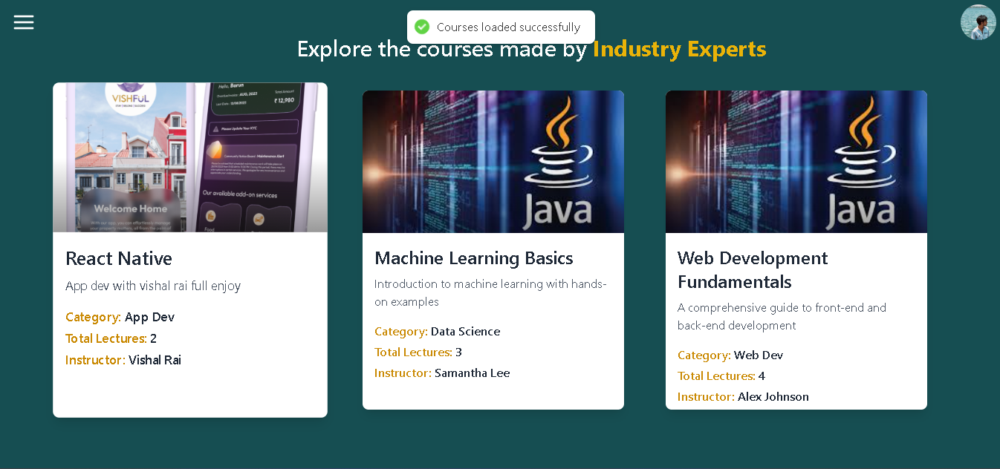

# Learning Management System 

The Learning Management System (LMS) is a comprehensive platform designed to facilitate online education and training programs. Developed using the MERN stack, this system is equipped with robust features to manage courses, users, and payments seamlessly. The platform is built to serve the needs of both educational institutions and corporate training programs, providing an intuitive interface for administrators, instructors, and students.


## Documentation

[API Documentation](https://lms-uqby.onrender.com/)

[Live Link](https://cousehub.vercel.app/)


## Installation

### Frontend 

```bash
  cd client
```
```bash
  npm install
```
```bash
  npm run start
```

### Backend 

```bash
  cd server
```
```bash
  npm install
```

#### Local
```bash
  npm run dev
```
#### Production
if using render 

```bash
  npm run start
```


    
## Tech Stack

**Client:**

- React 
- Redux 
- TailwindCSS
- axios  -
- React-router 
- chart.js
- etc

**Server:** 

- Nodejs
- Expressjs
- Mongoose
- Multer
- Cloudinary
- Json web token
- Razorpay
- Nodemailer


## Screenshots




